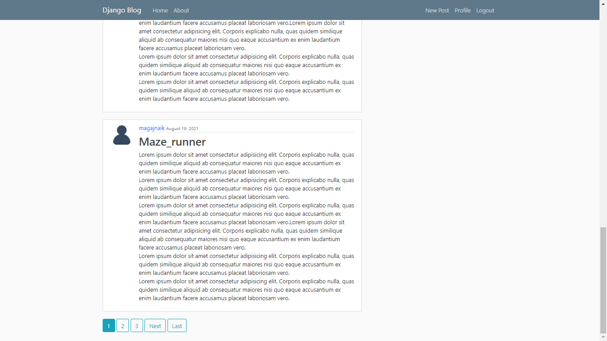
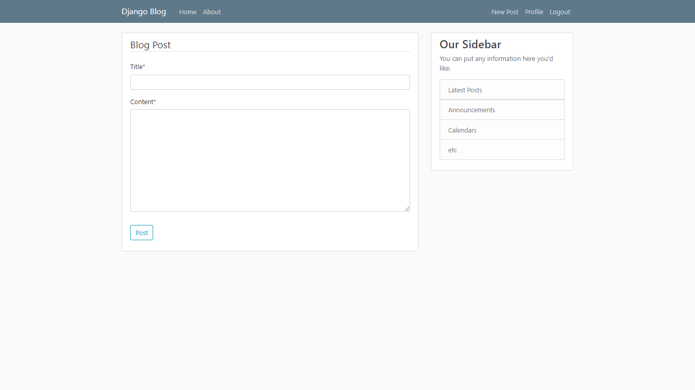
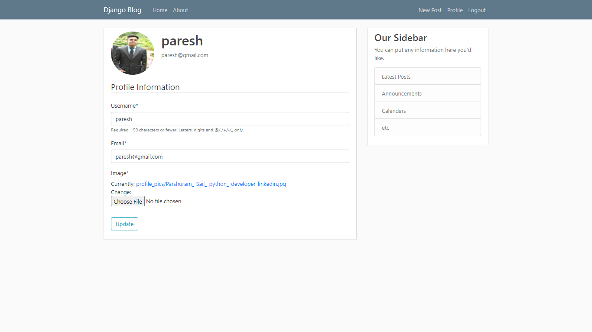

# Django Blog

Developed a Blog application with Python and Django which allows users to create, edit, and delete posts and update,delete Profile and User Password. The homepage will list all blog posts, and there will be a dedicated detail page for each individual post.

## Live Demo : [Link to Google](https://www.google.com)

## Features
* User registration
* User Login and logout
* User Profile
* Create, Update, Edit & Delete
* Password Reset
* User change Password
* User change Profile
* Pagination

## Skills Used
* Python 
* Django
* HTML
* CSS
* Bootstrap

## Result

